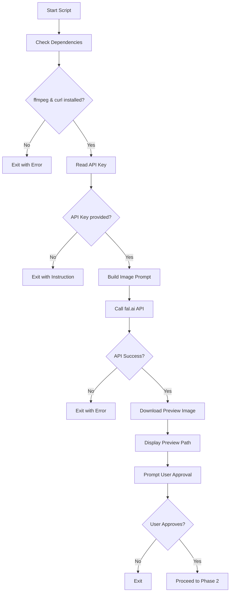
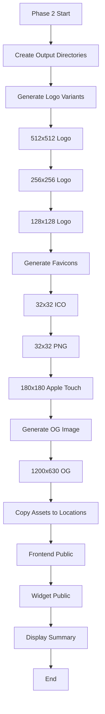

# Asset Generation Script Design

## Overview

A shell script to generate brand assets for the Botla chatbot platform using AI image generation, producing logo variations, Open Graph images, and favicons in multiple sizes. The script operates in two phases: preview generation and full asset generation.

## Objectives

- Generate a single preview image using fal.ai Nano Banana Pro model for user approval
- Upon approval, generate complete asset suite in required sizes using ffmpeg
- Minimize manual intervention and ensure consistent branding across all assets
- Support both frontend and widget applications

## Scope

### In Scope
- Script creation for asset generation workflow
- AI image generation integration with fal.ai
- Image resizing and format conversion using ffmpeg
- Asset organization in appropriate project directories
- Two-phase execution: preview then full generation

### Out of Scope
- Manual image editing or refinement
- Animation or video asset generation
- Backend logo storage implementation
- CDN upload or deployment automation

## Requirements

### Functional Requirements

1. **Preview Generation Phase**
   - Generate single base image using fal.ai API
   - Display preview image path for user review
   - Await user confirmation before proceeding

2. **Full Asset Generation Phase**
   - Generate multiple logo sizes for various use cases
   - Create favicon in multiple formats and sizes
   - Generate Open Graph image for social sharing
   - Preserve aspect ratios and quality during resizing

3. **Asset Organization**
   - Place assets in correct frontend and widget public directories
   - Use descriptive naming conventions
   - Maintain clean directory structure

### Non-Functional Requirements

1. **Usability**
   - Single command execution
   - Clear progress indicators
   - Informative error messages

2. **Reliability**
   - Validate API responses
   - Check ffmpeg availability
   - Handle network failures gracefully

3. **Maintainability**
   - Configurable parameters (sizes, paths, prompts)
   - Well-commented code sections
   - Easy API key injection

## System Context

### External Dependencies

| Dependency | Purpose | Version/Details |
|------------|---------|-----------------|
| fal.ai API | AI image generation | Nano Banana Pro model endpoint |
| ffmpeg | Image processing and resizing | Pre-installed on system |
| curl | HTTP API requests | Standard system utility |
| jq | JSON response parsing | Command-line JSON processor |

### Project Integration Points

| Location | Purpose | Asset Types |
|----------|---------|-------------|
| frontend/public/ | Main application assets | Logo, favicon, OG image |
| widget/public/ | Embedded widget assets | Logo variations |
| frontend/index.html | Favicon references | ICO, PNG favicons |
| widget/index.html | Widget favicon | SVG/PNG favicon |

## Asset Specifications

### Required Asset Types

| Asset Type | Dimensions | Format | Location | Usage |
|------------|-----------|--------|----------|-------|
| Base Logo | 1024x1024 | PNG | Both public dirs | Source for all variants |
| Logo Large | 512x512 | PNG | frontend/public/ | High-res displays |
| Logo Medium | 256x256 | PNG | Both public dirs | Standard displays |
| Logo Small | 128x128 | PNG | Both public dirs | Thumbnails |
| Favicon | 32x32 | ICO | Both public dirs | Browser tab icon |
| Favicon PNG | 32x32 | PNG | Both public dirs | Modern browsers |
| Apple Touch Icon | 180x180 | PNG | frontend/public/ | iOS home screen |
| OG Image | 1200x630 | PNG | frontend/public/ | Social media sharing |

### Image Generation Parameters

| Parameter | Value | Rationale |
|-----------|-------|-----------|
| Model | fal-ai/nano-banana-pro | Fast generation, good quality |
| Base Size | 1024x1024 | High quality source for downscaling |
| Format | PNG | Transparency support, lossless |
| Prompt Strategy | Brand-focused descriptive | Consistent with chatbot platform identity |

## Workflow Design

### Phase 1: Preview Generation



### Phase 2: Full Asset Generation



## Script Structure

### Configuration Section
- API endpoint URL
- API key placeholder
- Output directory paths
- Asset size definitions
- Image generation prompt template

### Dependency Validation
- Check for ffmpeg installation
- Check for curl availability
- Check for jq installation
- Verify write permissions for output directories

### API Integration
- Construct fal.ai API request payload
- Set appropriate headers with API key
- Handle JSON response parsing
- Extract image URL from response
- Download generated image

### Image Processing
- Use ffmpeg for high-quality resizing
- Apply appropriate filters for different sizes
- Convert formats where necessary
- Optimize file sizes for web delivery

### Asset Deployment
- Copy generated assets to frontend/public/
- Copy generated assets to widget/public/
- Create necessary subdirectories if missing
- Preserve file permissions

### User Interaction
- Display progress messages
- Show preview image location
- Request explicit approval before full generation
- Summarize generated assets upon completion

## Error Handling Strategy

| Error Scenario | Detection Method | Response Action |
|----------------|------------------|-----------------|
| Missing dependencies | Command existence check | Exit with installation instructions |
| No API key | Variable check | Exit with configuration guidance |
| API failure | HTTP status code | Display error message and exit |
| Invalid API response | JSON parsing | Display raw response and exit |
| ffmpeg failure | Exit code check | Display ffmpeg error and stop |
| File write failure | Filesystem operation | Display permission error and exit |
| User rejection | Interactive input | Clean exit without generation |

## Prompt Engineering

### Image Generation Prompt Structure

The AI generation prompt should convey the brand identity effectively:

| Element | Description | Example |
|---------|-------------|---------|
| Subject | Main visual focus | Professional chatbot logo |
| Style | Visual aesthetic | Modern, minimalist, tech-forward |
| Colors | Brand palette | Blue and white gradient |
| Composition | Layout structure | Centered icon, clean background |
| Details | Specific features | Speech bubble with AI elements |
| Format | Technical specs | Square format, transparent background |

### Example Prompt Template

```
A modern minimalist logo for a chatbot platform called 'Botla',
featuring a stylized speech bubble with subtle AI/tech elements,
gradient from deep blue to lighter blue, clean white background,
professional and trustworthy aesthetic, suitable for SaaS product,
square format, high detail
```

## Output Specifications

### Success Output

Upon successful completion, the script displays:
- Preview image path
- Confirmation of user approval
- List of generated assets with sizes
- Final locations of deployed assets
- Summary count of total assets created

### Directory Structure After Execution

```
frontend/public/
├── logo-1024.png
├── logo-512.png
├── logo-256.png
├── logo-128.png
├── favicon.ico
├── favicon.png
├── apple-touch-icon.png
└── og-image.png

widget/public/
├── logo-256.png
├── logo-128.png
├── favicon.ico
└── favicon.png
```

## Script Execution Flow

### Command Invocation
```
bash scripts/generate-assets.sh
```

### Interactive Flow
1. Script validates environment and dependencies
2. Script sends request to fal.ai with configured prompt
3. Script downloads preview image to temporary location
4. Script displays preview path and waits for user input
5. User reviews image and responds with yes/no
6. If approved, script proceeds with ffmpeg processing
7. Script generates all required asset sizes
8. Script copies assets to designated locations
9. Script displays completion summary

### Expected User Actions
- Review preview image file
- Type confirmation response when prompted
- Verify generated assets in public directories

## Quality Considerations

### Image Quality Parameters

| Aspect | Strategy | Implementation |
|--------|----------|----------------|
| Resolution | Generate high, scale down | Start with 1024x1024 base |
| Sharpness | Maintain during resize | Use lanczos filter in ffmpeg |
| Transparency | Preserve alpha channel | PNG format throughout |
| File Size | Balance quality vs size | Optimize compression for web |
| Consistency | Single source image | All variants from one master |

### Validation Checks

| Check | Purpose | Method |
|-------|---------|--------|
| File existence | Confirm generation | Test file paths |
| File size | Detect failures | Check non-zero size |
| Image dimensions | Verify correctness | Parse ffmpeg output |
| Format validity | Ensure usability | File type verification |

## Security Considerations

### API Key Management
- API key injected manually into script after generation
- Not committed to version control
- Stored as environment variable or in-script constant
- Script includes placeholder comment for easy location

### Input Validation
- Sanitize user input for approval prompt
- Validate API response structure
- Check downloaded file integrity

### File System Safety
- Verify write permissions before operations
- Use absolute paths to prevent directory confusion
- Avoid overwriting existing assets without confirmation

## Extensibility

### Future Enhancements
- Support for multiple prompt variations
- Batch generation with different themes
- Asset versioning system
- Automated deployment to CDN
- Integration with design system tokens
- Support for additional image formats (WebP, AVIF)

### Configuration Externalization
- Move prompt to external configuration file
- Support multiple brand variants
- Allow custom size specifications
- Enable output path customization

## Testing Strategy

### Manual Testing Checklist
- Run script with missing dependencies
- Run script without API key
- Run script with invalid API key
- Approve preview image
- Reject preview image
- Verify all asset dimensions
- Check asset quality visually
- Confirm proper file placement

### Verification Steps
- Inspect each generated file
- Compare dimensions against specifications
- Test favicon display in browser
- Validate OG image in social media debuggers
- Check logo transparency
- Verify file format correctness

## Documentation Requirements

### Script Comments
- Header with purpose and usage instructions
- Section markers for each major step
- Explanation of ffmpeg commands
- API request structure documentation
- Variable purpose descriptions

### README Integration
- Add script documentation to project README
- Include example usage
- Document required API key setup
- List generated asset inventory

## Success Criteria

The asset generation script is considered successful when:
- Single execution generates all required assets
- Preview phase allows user to validate before full generation
- All assets meet dimensional specifications
- Assets are placed in correct project locations
- Script provides clear progress feedback
- Error conditions are handled gracefully
- Generated assets display correctly in frontend and widget applications
