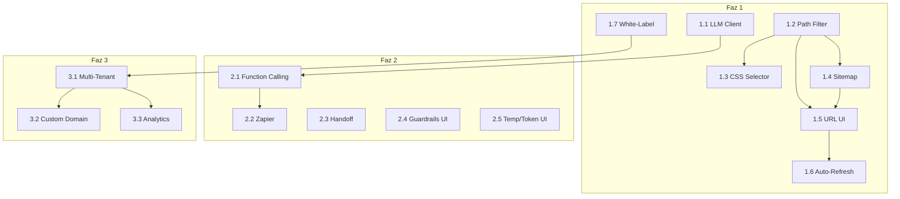

# Botla.co Geliştirme Ana Yol Haritası

Bu doküman, tüm planlanan özelliklerin kronolojik sırasını ve bağımlılıklarını gösterir.

---

## Genel Bakış

```
┌─────────────────────────────────────────────────────────────────────────────┐
│                           FAZ 1: TEMEL ÜRÜN UYUMLARI                        │
│                              (Tahmini: 6-8 Hafta)                           │
├─────────────────────────────────────────────────────────────────────────────┤
│ 1.1 → 1.2 → 1.3 → 1.4 → 1.5 → 1.6 → 1.7                                     │
│  │     │     │     │     │     │     │                                      │
│  ▼     ▼     ▼     ▼     ▼     ▼     ▼                                      │
│ LLM   Path  CSS  Sitemap URL  Auto  White                                   │
│Client Filter Sel  Parse  UI   Refr  Label                                   │
└─────────────────────────────────────────────────────────────────────────────┘
                                    │
                                    ▼
┌─────────────────────────────────────────────────────────────────────────────┐
│                        FAZ 2: ENTEGRASYONLAR                                │
│                           (Tahmini: 6-8 Hafta)                              │
├─────────────────────────────────────────────────────────────────────────────┤
│ 2.1 → 2.2 → 2.3 → 2.4 → 2.5                                                 │
│  │     │     │     │     │                                                  │
│  ▼     ▼     ▼     ▼     ▼                                                  │
│Func  Zapier Handoff Guard Temp/                                             │
│Call  Integr        UI    Token                                              │
└─────────────────────────────────────────────────────────────────────────────┘
                                    │
                                    ▼
┌─────────────────────────────────────────────────────────────────────────────┐
│                        FAZ 3: AJANS VE WHITE-LABEL                          │
│                           (Tahmini: 8-12 Hafta)                             │
├─────────────────────────────────────────────────────────────────────────────┤
│ 3.1 → 3.2 → 3.3                                                             │
│  │     │     │                                                              │
│  ▼     ▼     ▼                                                              │
│Multi Custom Gelişmiş                                                        │
│Tenant Domain Analytics                                                      │
└─────────────────────────────────────────────────────────────────────────────┘
```

---

## Kronolojik Sıralama ve Bağımlılıklar

### Faz 1: Temel Ürün Uyumları

| Sıra | Plan Dosyası | Özellik | Bağımlılık | Tahmini Süre |
|------|--------------|---------|------------|--------------|
| 1.1 | [01-llm-client-abstraction.md](./01-llm-client-abstraction.md) | LLM Client Soyutlaması | - | 1 hafta |
| 1.2 | [02-path-based-filtering.md](./02-path-based-filtering.md) | Path Tabanlı Filtreleme | - | 1 hafta |
| 1.3 | [03-css-selector-scraping.md](./03-css-selector-scraping.md) | CSS Selector Bölge Seçimi | 1.2 | 3-4 gün |
| 1.4 | [04-sitemap-parser.md](./04-sitemap-parser.md) | Sitemap İçe Alma | 1.2 | 3-4 gün |
| 1.5 | [05-url-checkbox-ui.md](./05-url-checkbox-ui.md) | URL Checkbox Seçimi UI | 1.2, 1.4 | 1 hafta |
| 1.6 | [06-auto-refresh-scheduler.md](./06-auto-refresh-scheduler.md) | Auto-Refresh Scheduler | 1.5 | 1 hafta |
| 1.7 | [07-white-label-branding.md](./07-white-label-branding.md) | Branding Kaldırma | - | 3-4 gün |

### Faz 2: Entegrasyonlar ve Guardrails

| Sıra | Plan Dosyası | Özellik | Bağımlılık | Tahmini Süre |
|------|--------------|---------|------------|--------------|
| 2.1 | [08-function-calling.md](./08-function-calling.md) | Function Calling | 1.1 | 1.5 hafta |
| 2.2 | [09-zapier-integration.md](./09-zapier-integration.md) | Zapier Entegrasyonu | 2.1 | 1 hafta |
| 2.3 | [10-operator-handoff.md](./10-operator-handoff.md) | Operatör Handoff | - | 1.5 hafta |
| 2.4 | [11-guardrails-ui.md](./11-guardrails-ui.md) | Guardrails UI | - | 3-4 gün |
| 2.5 | [12-temperature-tokens-ui.md](./12-temperature-tokens-ui.md) | Temperature/MaxTokens UI | - | 2-3 gün |

### Faz 3: Ajans ve White-Label Genişlemeleri

| Sıra | Plan Dosyası | Özellik | Bağımlılık | Tahmini Süre |
|------|--------------|---------|------------|--------------|
| 3.1 | [13-multi-tenant.md](./13-multi-tenant.md) | Çok Kiracılı Yapı | 1.7 | 2-3 hafta |
| 3.2 | [14-custom-domain.md](./14-custom-domain.md) | Custom Domain Routing | 3.1 | 1.5 hafta |
| 3.3 | [15-advanced-analytics.md](./15-advanced-analytics.md) | Gelişmiş Analytics | 3.1 | 1 hafta |

---

## Bağımlılık Grafiği



---

## Proje Konvansiyonları

### Backend (Go)

| Araç | Kullanım |
|------|----------|
| `make be-run` | Sunucuyu çalıştır (PDF destekli) |
| `make test-all` | Tüm testleri çalıştır |
| `make lint` | golangci-lint ile kod kalitesi kontrolü |
| `make sqlc-generate` | Veritabanı sorgu kodlarını oluştur |
| `make migrate-up` | Migration'ları uygula |

### Frontend (React/TypeScript)

| Araç | Kullanım |
|------|----------|
| `make fe-run` | Frontend dev server |
| `npm run build` | Production build |
| `npm run test` | Jest testleri |

### Test Coverage

- **Hedef:** %90 minimum coverage
- **Komut:** `make cover-gate` (başarısız olursa CI kırılır)

### Migration Kuralları

1. Her migration için `up.sql` ve `down.sql` gerekli
2. Dosya adı: `XXXXXX_description.{up,down}.sql`
3. Migration sonrası: `make sqlc-generate`

---

## Öncelik Matrisi

| Etki/Çaba | Düşük Çaba | Orta Çaba | Yüksek Çaba |
|-----------|------------|-----------|-------------|
| **Yüksek Etki** | 1.7, 2.5 | 1.2, 1.4, 2.4 | 1.1, 2.1, 2.3 |
| **Orta Etki** | 1.3, 1.6 | 1.5, 2.2 | 3.1 |
| **Düşük Etki** | - | 3.3 | 3.2 |

---

## 🚀 Önerilen Uygulama Sırası

Aşağıda, bağımlılıkları ve paralel çalışma fırsatlarını dikkate alarak optimize edilmiş uygulama sırası verilmiştir.

### Sprint 1 (Hafta 1-2): Temel Altyapı

```
┌─────────────────────────────────────────────────────────────────┐
│  Paralel Çalışılabilir:                                         │
│                                                                  │
│  [1.1 LLM Client]     [1.2 Path Filter]     [1.7 White-Label]   │
│       ↓                     ↓                     ↓              │
│  Claude/Gemini         Scraper için          Plan bazlı         │
│  desteği               temel altyapı         branding           │
└─────────────────────────────────────────────────────────────────┘
```

| Sıra | Plan | Neden Bu Sırada? | Paralel? |
|------|------|------------------|----------|
| 1 | **1.2 Path Filtering** | Diğer 4 plan buna bağımlı (1.3, 1.4, 1.5, 1.6) | ✅ Paralel başlat |
| 2 | **1.1 LLM Client** | Faz 2'deki Function Calling buna bağımlı | ✅ Paralel başlat |
| 3 | **1.7 White-Label** | Bağımsız, Faz 3 için temel | ✅ Paralel başlat |

---

### Sprint 2 (Hafta 3-4): Veri Toplama Özellikleri

```
┌─────────────────────────────────────────────────────────────────┐
│  1.2 tamamlandıktan sonra:                                      │
│                                                                  │
│  [1.3 CSS Selector]  ───┐                                       │
│                         ├──→  [1.5 URL Checkbox UI]             │
│  [1.4 Sitemap Parser]  ─┘                                       │
│                                                                  │
│  Paralel: [2.4 Guardrails UI]  [2.5 Temp/Token UI]             │
└─────────────────────────────────────────────────────────────────┘
```

| Sıra | Plan | Neden Bu Sırada? | Paralel? |
|------|------|------------------|----------|
| 4 | **1.3 CSS Selector** | 1.2'ye bağımlı, scraper'ı genişletir | ✅ 1.4 ile paralel |
| 5 | **1.4 Sitemap Parser** | 1.2'ye bağımlı, bağımsız modül | ✅ 1.3 ile paralel |
| 6 | **2.4 Guardrails UI** | Bağımsız, hızlı kazanım | ✅ 1.3/1.4 ile paralel |
| 7 | **2.5 Temp/Token UI** | Bağımsız, backend zaten hazır | ✅ 1.3/1.4 ile paralel |

---

### Sprint 3 (Hafta 5-6): URL Yönetimi ve Refresh

```
┌─────────────────────────────────────────────────────────────────┐
│  1.3 ve 1.4 tamamlandıktan sonra:                               │
│                                                                  │
│  [1.5 URL Checkbox UI]  ───→  [1.6 Auto-Refresh Scheduler]      │
│                                                                  │
│  Paralel: [2.3 Operator Handoff]                                │
└─────────────────────────────────────────────────────────────────┘
```

| Sıra | Plan | Neden Bu Sırada? | Paralel? |
|------|------|------------------|----------|
| 8 | **1.5 URL Checkbox UI** | 1.3 ve 1.4'e bağımlı, kullanıcı talebi yüksek | ❌ Sıralı (1.3, 1.4 bitmeli) |
| 9 | **2.3 Operator Handoff** | Bağımsız, müşteri memnuniyeti için kritik | ✅ 1.5 ile paralel |
| 10 | **1.6 Auto-Refresh** | 1.5'e bağımlı | ❌ 1.5 bitmeli |

---

### Sprint 4 (Hafta 7-8): Function Calling ve Entegrasyonlar

```
┌─────────────────────────────────────────────────────────────────┐
│  1.1 tamamlandıktan sonra:                                      │
│                                                                  │
│  [2.1 Function Calling]  ───→  [2.2 Zapier Integration]         │
│                                                                  │
│  Bu sprint Faz 1'in tamamlanmasını işaret eder ✅               │
└─────────────────────────────────────────────────────────────────┘
```

| Sıra | Plan | Neden Bu Sırada? | Paralel? |
|------|------|------------------|----------|
| 11 | **2.1 Function Calling** | 1.1'e bağımlı, Actions altyapısı | ❌ 1.1 bitmeli |
| 12 | **2.2 Zapier Integration** | 2.1'e bağımlı | ❌ 2.1 bitmeli |

---

### Sprint 5-7 (Hafta 9-14): Ajans ve Enterprise

```
┌─────────────────────────────────────────────────────────────────┐
│  1.7 tamamlandıktan sonra:                                      │
│                                                                  │
│  [3.1 Multi-Tenant] ───┬──→ [3.2 Custom Domain]                 │
│                        └──→ [3.3 Advanced Analytics]            │
│                                                                  │
│  Bu fazda paralel çalışma sınırlı, karmaşıklık yüksek           │
└─────────────────────────────────────────────────────────────────┘
```

| Sıra | Plan | Neden Bu Sırada? | Paralel? |
|------|------|------------------|----------|
| 13 | **3.1 Multi-Tenant** | 1.7'ye bağımlı, ajans modeli için temel | ❌ 1.7 bitmeli |
| 14 | **3.2 Custom Domain** | 3.1'e bağımlı | ✅ 3.3 ile paralel |
| 15 | **3.3 Advanced Analytics** | 3.1'e bağımlı | ✅ 3.2 ile paralel |

---

## 📅 Haftalık Gantt Görünümü

```
Hafta:  1    2    3    4    5    6    7    8    9   10   11   12   13   14
        ─────────────────────────────────────────────────────────────────────
1.1     ████████                                    (LLM Client)
1.2     ████████                                    (Path Filter)
1.7     ██████                                      (White-Label)
1.3          ████████                               (CSS Selector)
1.4          ████████                               (Sitemap)
2.4          ██████                                 (Guardrails)
2.5          ████                                   (Temp/Token)
1.5               ████████                          (URL Checkbox)
2.3               ████████████                      (Handoff)
1.6                    ████████                     (Auto-Refresh)
2.1                         ████████████            (Function Calling)
2.2                              ████████           (Zapier)
3.1                                   ████████████████████████    (Multi-Tenant)
3.2                                                  ████████████ (Custom Domain)
3.3                                                  ████████     (Analytics)
```

---

## ⚡ Hızlı Başlangıç Önerisi

Eğer hızlı sonuç almak istiyorsanız, aşağıdaki sırayla başlayın:

### Minimum Viable Product (MVP) - 4 Hafta

1. **1.2 Path Filtering** → Kullanıcıların veri kalitesini artırır
2. **1.4 Sitemap Parser** → Hızlı veri toplama
3. **1.5 URL Checkbox UI** → En çok talep edilen özellik
4. **2.4 Guardrails UI** → Halüsinasyon kontrolü

### Değer Odaklı Sıralama

| Öncelik | Plan | Kullanıcı Değeri |
|---------|------|------------------|
| 🥇 1 | 1.5 URL Checkbox UI | "Hangi sayfaların taranacağını seçmek istiyorum" |
| 🥈 2 | 1.4 Sitemap Parser | "Sitemap'imden içe aktarmak istiyorum" |
| 🥉 3 | 2.3 Operator Handoff | "Bot cevaplayamazsa insana aktarsın" |
| 4 | 1.1 LLM Client | "Claude/Gemini kullanmak istiyorum" |
| 5 | 1.7 White-Label | "Kendi markamı göstermek istiyorum" |

---

## ✅ Başlangıç Kontrol Listesi

Geliştirmeye başlamadan önce:

- [ ] `make migrate-up` çalıştırıldı
- [ ] `make test-all` başarılı
- [ ] `make lint` hatasız
- [ ] Docker servisleri çalışıyor (`make up`)
- [ ] `.env` dosyası güncel

---

*Son Güncelleme: 2025-12-07*
