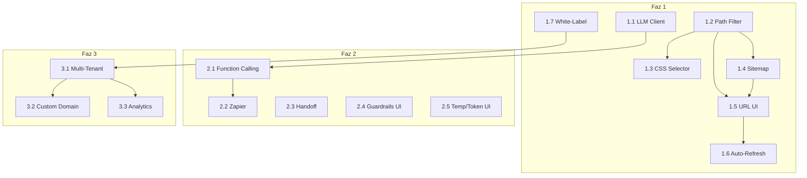

# Botla.co Geliştirme Ana Yol Haritası

Bu doküman, tüm planlanan özelliklerin kronolojik sırasını ve bağımlılıklarını gösterir.

---

## Genel Bakış

```
┌─────────────────────────────────────────────────────────────────────────────┐
│                           FAZ 1: TEMEL ÜRÜN UYUMLARI                        │
│                              (Tahmini: 6-8 Hafta)                           │
├─────────────────────────────────────────────────────────────────────────────┤
│ 1.1 → 1.2 → 1.3 → 1.4 → 1.5 → 1.6 → 1.7                                     │
│  │     │     │     │     │     │     │                                      │
│  ▼     ▼     ▼     ▼     ▼     ▼     ▼                                      │
│ LLM   Path  CSS  Sitemap URL  Auto  White                                   │
│Client Filter Sel  Parse  UI   Refr  Label                                   │
└─────────────────────────────────────────────────────────────────────────────┘
                                    │
                                    ▼
┌─────────────────────────────────────────────────────────────────────────────┐
│                        FAZ 2: ENTEGRASYONLAR                                │
│                           (Tahmini: 6-8 Hafta)                              │
├─────────────────────────────────────────────────────────────────────────────┤
│ 2.1 → 2.2 → 2.3 → 2.4 → 2.5                                                 │
│  │     │     │     │     │                                                  │
│  ▼     ▼     ▼     ▼     ▼                                                  │
│Func  Zapier Handoff Guard Temp/                                             │
│Call  Integr        UI    Token                                              │
└─────────────────────────────────────────────────────────────────────────────┘
                                    │
                                    ▼
┌─────────────────────────────────────────────────────────────────────────────┐
│                        FAZ 3: AJANS VE WHITE-LABEL                          │
│                           (Tahmini: 8-12 Hafta)                             │
├─────────────────────────────────────────────────────────────────────────────┤
│ 3.1 → 3.2 → 3.3                                                             │
│  │     │     │                                                              │
│  ▼     ▼     ▼                                                              │
│Multi Custom Gelişmiş                                                        │
│Tenant Domain Analytics                                                      │
└─────────────────────────────────────────────────────────────────────────────┘
```

---

## Kronolojik Sıralama ve Bağımlılıklar

### Faz 1: Temel Ürün Uyumları

| Sıra | Plan Dosyası | Özellik | Bağımlılık | Tahmini Süre |
|------|--------------|---------|------------|--------------|
| 1.1 | [01-llm-client-abstraction.md](./01-llm-client-abstraction.md) | LLM Client Soyutlaması | - | 1 hafta |
| 1.2 | [02-path-based-filtering.md](./02-path-based-filtering.md) | Path Tabanlı Filtreleme | - | 1 hafta |
| 1.3 | [03-css-selector-scraping.md](./03-css-selector-scraping.md) | CSS Selector Bölge Seçimi | 1.2 | 3-4 gün |
| 1.4 | [04-sitemap-parser.md](./04-sitemap-parser.md) | Sitemap İçe Alma | 1.2 | 3-4 gün |
| 1.5 | [05-url-checkbox-ui.md](./05-url-checkbox-ui.md) | URL Checkbox Seçimi UI | 1.2, 1.4 | 1 hafta |
| 1.6 | [06-auto-refresh-scheduler.md](./06-auto-refresh-scheduler.md) | Auto-Refresh Scheduler | 1.5 | 1 hafta |
| 1.7 | [07-white-label-branding.md](./07-white-label-branding.md) | Branding Kaldırma | - | 3-4 gün |

### Faz 2: Entegrasyonlar ve Guardrails

| Sıra | Plan Dosyası | Özellik | Bağımlılık | Tahmini Süre |
|------|--------------|---------|------------|--------------|
| 2.1 | [08-function-calling.md](./08-function-calling.md) | Function Calling | 1.1 | 1.5 hafta |
| 2.2 | [09-zapier-integration.md](./09-zapier-integration.md) | Zapier Entegrasyonu | 2.1 | 1 hafta |
| 2.3 | [10-operator-handoff.md](./10-operator-handoff.md) | Operatör Handoff | - | 1.5 hafta |
| 2.4 | [11-guardrails-ui.md](./11-guardrails-ui.md) | Guardrails UI | - | 3-4 gün |
| 2.5 | [12-temperature-tokens-ui.md](./12-temperature-tokens-ui.md) | Temperature/MaxTokens UI | - | 2-3 gün |

### Faz 3: Ajans ve White-Label Genişlemeleri

| Sıra | Plan Dosyası | Özellik | Bağımlılık | Tahmini Süre |
|------|--------------|---------|------------|--------------|
| 3.1 | [13-multi-tenant.md](./13-multi-tenant.md) | Çok Kiracılı Yapı | 1.7 | 2-3 hafta |
| 3.2 | [14-custom-domain.md](./14-custom-domain.md) | Custom Domain Routing | 3.1 | 1.5 hafta |
| 3.3 | [15-advanced-analytics.md](./15-advanced-analytics.md) | Gelişmiş Analytics | 3.1 | 1 hafta |

---

## Bağımlılık Grafiği



---

## Proje Konvansiyonları

### Backend (Go)

| Araç | Kullanım |
|------|----------|
| `make be-run` | Sunucuyu çalıştır (PDF destekli) |
| `make test-all` | Tüm testleri çalıştır |
| `make lint` | golangci-lint ile kod kalitesi kontrolü |
| `make sqlc-generate` | Veritabanı sorgu kodlarını oluştur |
| `make migrate-up` | Migration'ları uygula |

### Frontend (React/TypeScript)

| Araç | Kullanım |
|------|----------|
| `make fe-run` | Frontend dev server |
| `npm run build` | Production build |
| `npm run test` | Jest testleri |

### Test Coverage

- **Hedef:** %90 minimum coverage
- **Komut:** `make cover-gate` (başarısız olursa CI kırılır)

### Migration Kuralları

1. Her migration için `up.sql` ve `down.sql` gerekli
2. Dosya adı: `XXXXXX_description.{up,down}.sql`
3. Migration sonrası: `make sqlc-generate`

---

## Öncelik Matrisi

| Etki/Çaba | Düşük Çaba | Orta Çaba | Yüksek Çaba |
|-----------|------------|-----------|-------------|
| **Yüksek Etki** | 1.7, 2.5 | 1.2, 1.4, 2.4 | 1.1, 2.1, 2.3 |
| **Orta Etki** | 1.3, 1.6 | 1.5, 2.2 | 3.1 |
| **Düşük Etki** | - | 3.3 | 3.2 |

---

*Son Güncelleme: 2025-12-06*
