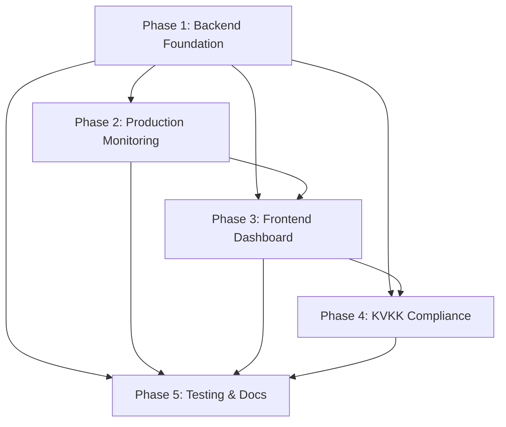

# Admin Dashboard Implementation Plans

This directory contains detailed, step-by-step implementation plans for the Botla Admin Dashboard.

## How to Use

1. **Work through phases in order** - Each phase builds on the previous ones
2. **Check off completed items** - Mark checkboxes as `[x]` when done
3. **Follow verification steps** - Each phase includes testing instructions
4. **Update progress in task.md** - Keep the master tracker updated

---

## Implementation Phases

| Phase | File | Est. Time | Priority | Description |
|-------|------|-----------|----------|-------------|
| 1 | [01-backend-foundation.md](./01-backend-foundation.md) | 3-4 days | Critical | Admin auth, database, core API |
| 2 | [02-production-monitoring.md](./02-production-monitoring.md) | 2-3 days | Critical | Health checks, queues, errors |
| 3 | [03-frontend-dashboard.md](./03-frontend-dashboard.md) | 5-7 days | High | React admin UI |
| 4 | [04-kvkk-compliance.md](./04-kvkk-compliance.md) | 3-4 days | Medium | Privacy/KVKK features |
| 5 | [05-testing-documentation.md](./05-testing-documentation.md) | 2-3 days | High | Tests, security, docs |

**Total Estimated Time:** 15-21 days

---

## Quick Start (Week 1 Priority)

For immediate production issue tackling, complete these in order:

### Day 1-2: Backend Foundation
- [x] Database migration (`000041_admin_platform.up.sql`)
- [x] User model update (`is_platform_admin`)
- [x] Admin middleware
- [x] CLI for creating admin user

### Day 3-4: Production Monitoring  
- [x] Detailed health checks (DB, Redis, Qdrant, OpenAI)
- [ ] Queue monitoring (pending, stuck jobs)
- [ ] Error tracking service

### Day 5-7: Basic Frontend
- [x] Admin layout and routes
- [x] Dashboard overview page
- [ ] System health page
- [ ] Queues management page

---

## Dependencies Overview

---

## Files Created Per Phase

### Phase 1 (Backend Foundation)
- `db/migrations/000041_admin_platform.{up,down}.sql`
- `internal/api/middleware/admin.go`
- `internal/services/admin_service.go`
- `internal/db/admin_*.go`
- `internal/api/handlers/admin_*.go`
- `internal/api/routes/admin.go`
- `cmd/cli/main.go`

### Phase 2 (Production Monitoring)
- `internal/api/handlers/admin_health.go`
- `internal/api/handlers/admin_queues.go`
- `internal/api/handlers/admin_errors.go`
- `internal/services/error_logger.go`
- `pkg/middleware/error_logger.go`

### Phase 3 (Frontend)
- `frontend/src/api/admin.ts`
- `frontend/src/features/admin/*.tsx`
- `frontend/src/pages/admin/*.tsx`

### Phase 4 (KVKK)
- `db/migrations/000042_kvkk_compliance.{up,down}.sql`
- `internal/services/privacy_service.go`
- `internal/services/retention_job.go`
- `internal/api/handlers/privacy.go`
- `frontend/src/pages/PrivacySettingsPage.tsx`

### Phase 5 (Testing & Docs)
- `internal/integration/admin_*.go`
- `docs/admin-api.md`
- `docs/kvkk-compliance.md`
- `docs/admin-runbook.md`

---

## Related Documents

- [Main Admin Dashboard Plan](../admin_dashboard_plan.md) - Overview and requirements
- [Project README](../README.md) - Project setup instructions
