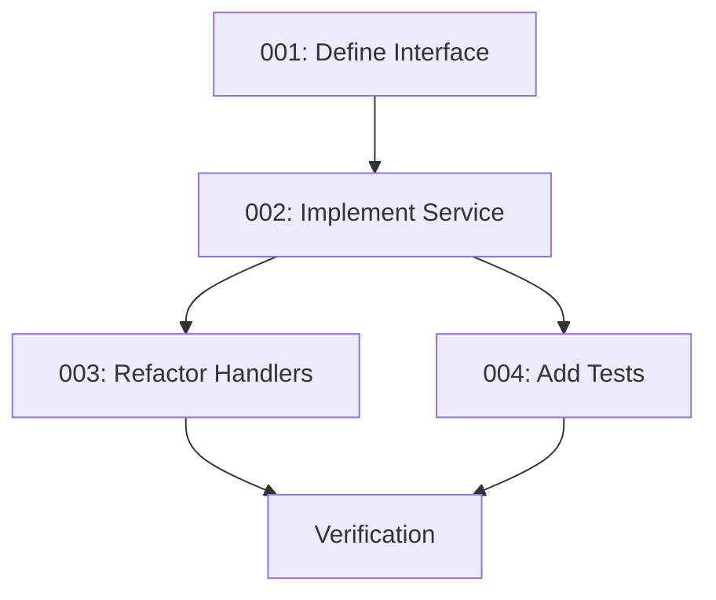

# Service Layer Refactoring

This folder contains tasks to address the **"Leaking Business Logic into HTTP Handlers"** problem in the codebase.

## Problem Summary

HTTP Handlers currently contain core business logic rather than acting solely as a transport layer. For example, the decision to regenerate a `ToolName` when an action's name changes is hardcoded inside the handler method.

### Why This Increases Maintenance Cost

| Issue | Impact |
|-------|--------|
| **Untestable Logic** | Cannot test the "regenerate tool name" logic without mocking HTTP requests and responses |
| **Low Reusability** | If `ChatbotAction` needs to be updated via a background job or CLI, this logic will be skipped or must be duplicated |
| **Tight Coupling** | HTTP layer is coupled to business rules, making changes risky |
| **Scattered Logic** | Business rules spread across handlers, hard to reason about |

### Evidence

From `internal/api/handlers/action.go`:

```go
if nameChanged || descChanged || toolNameMissing {
    // ... logic to prepare new name ...
    toolName, err = h.ToolNameGenerator.Generate(r.Context(), newName, newDesc)
    // ... error handling ...
    action.ToolName = &toolName
}
```

## Solution

Introduce a proper **Service Layer** following clean architecture principles:

```
┌─────────────────┐
│   HTTP Handler  │  ← Parse request, call service, format response
└────────┬────────┘
         │
         ▼
┌─────────────────┐
│     Service     │  ← Business logic, orchestration, side effects
└────────┬────────┘
         │
         ▼
┌─────────────────┐
│   Repository    │  ← Data access only
└─────────────────┘
```

## Task Index

| Task | Description | Complexity | Dependencies |
|------|-------------|------------|--------------|
| [001](./001-define-action-service-interface.md) | Define ActionService Interface | Low | None |
| [002](./002-implement-action-service.md) | Implement ActionService | Medium | 001 |
| [003](./003-refactor-action-handlers.md) | Refactor Action Handlers to Use ActionService | Medium | 002 |
| [004](./004-add-action-service-tests.md) | Add Comprehensive ActionService Tests | Medium | 002 |

## Execution Order



## Guiding Principles

1. **Handlers should only**:
   - Parse HTTP request (path params, query params, body)
   - Call service methods
   - Format HTTP response (status codes, JSON encoding)
   - Handle HTTP-specific errors (401, 403, 404)

2. **Services should**:
   - Contain all business logic
   - Orchestrate operations (LLM calls, DB updates, version checks)
   - Be fully unit-testable without HTTP mocking
   - Be reusable from CLI, background jobs, or other entry points

3. **Apply strict TDD**:
   - Write failing tests first
   - Implement minimal code to pass
   - Refactor

## Estimated Effort

| Phase | Tasks | Time Estimate |
|-------|-------|---------------|
| Phase 1: Interface & Implementation | 001-002 | 2-3 hours |
| Phase 2: Handler Refactoring | 003 | 2-3 hours |
| Phase 3: Testing | 004 | 2-3 hours |

**Total**: ~6-9 hours
