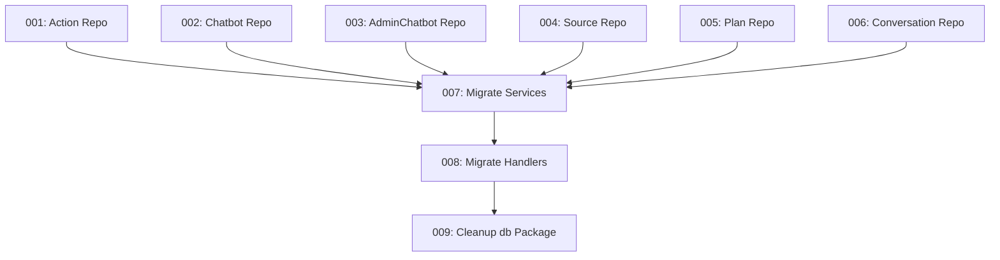

# Tech Debt: Repository Consolidation

This folder contains tasks to eliminate the redundant data access abstraction pattern in the codebase.

## Problem Summary

The codebase has two layers for database interactions that effectively do the same thing:
- `internal/repository` contains thin wrappers (e.g., `PostgresActionRepo`) 
- `internal/db` contains the actual SQL logic (e.g., `db.GetActions`)

Repository methods simply delegate to db functions, creating double maintenance burden.

## Solution

Merge `internal/db` logic into `internal/repository` using **Squirrel SQL builder** (`github.com/Masterminds/squirrel v1.5.4`).

## Task Index

| Task | Description | Complexity | Dependencies |
|------|-------------|------------|--------------|
| [001](./001-consolidate-action-repository.md) | Consolidate Action Repository | Medium | None |
| [002](./002-consolidate-chatbot-repository.md) | Consolidate Chatbot Repository | Medium | None |
| [003](./003-consolidate-admin-chatbot-repository.md) | Consolidate AdminChatbot Repository | Medium | None |
| [004](./004-implement-source-repository.md) | Implement Source Repository | Medium | None |
| [005](./005-create-plan-repository.md) | Create Plan Repository | Low | None |
| [006](./006-create-conversation-repository.md) | Create Conversation Repository | Low | None |
| [007](./007-migrate-services-to-repositories.md) | Migrate Services to Repositories | High | 001-006 |
| [008](./008-migrate-handlers-to-repositories.md) | Migrate Handlers to Repositories | High | 001-006, 007 |
| [009](./009-deprecate-cleanup-db-package.md) | Deprecate/Cleanup db Package | Medium | 007, 008 |

## Execution Order



## Squirrel Pattern

All repository implementations should use Squirrel for SQL building:

```go
import sq "github.com/Masterminds/squirrel"

var psql = sq.StatementBuilder.PlaceholderFormat(sq.Dollar)

func (r *PostgresXxxRepo) GetByID(ctx context.Context, id string) (*models.Xxx, error) {
    query, args, err := psql.
        Select("id", "name", "created_at").
        From("xxx_table").
        Where(sq.Eq{"id": id}).
        ToSql()
    if err != nil {
        return nil, err
    }
    
    var item models.Xxx
    err = r.pool.QueryRowContext(ctx, query, args...).Scan(&item.ID, &item.Name, &item.CreatedAt)
    // ...
}
```

## Testing Strategy

Each task should:
1. Run existing tests as baseline
2. Make changes incrementally
3. Verify tests pass after each change
4. Use mock repositories for unit tests
5. Use real database for integration tests

## Estimated Effort

| Phase | Tasks | LOC Changed | Time Estimate |
|-------|-------|-------------|---------------|
| Phase 1: Repository Consolidation | 001-006 | ~2000 | 3-4 days |
| Phase 2: Service Migration | 007 | ~500 | 1-2 days |
| Phase 3: Handler Migration | 008 | ~800 | 1-2 days |
| Phase 4: Cleanup | 009 | ~1500 (deleted) | 1 day |

**Total**: ~6-9 development days
